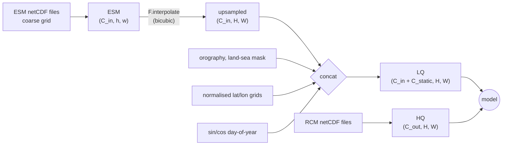

# Climate Downscaling with Stochastic Interpolants

Deep-learning **climate downscaling**: turn coarse Earth System Model (ESM) output into
high-resolution regional climate fields, at a fraction of the cost of running a dynamical
regional climate model (RCM).

This branch (`clim-downscaling`) is a downscaling-only fork of
[neural-lam](https://github.com/mllam/neural-lam). The graph-based limited-area *forecasting*
models that the upstream repository is built around are not used here — see
[Relationship to upstream neural-lam](#relationship-to-upstream-neural-lam).

The reference setup downscales daily **EC-Earth3-Veg** fields to the **HCLIM43-ALADIN**
EUR-11/EUR-12 grid over Europe (a `400 x 550` grid), using
[PyTorch](https://pytorch.org/) + [PyTorch Lightning](https://lightning.ai/pytorch-lightning),
with logging through [Weights & Biases](https://wandb.ai/).

Three model families are supported:

| Model | `--model` | Type | What it does |
| --- | --- | --- | --- |
| **SI / CDSI** | `SI` | Generative (ensemble) | Stochastic interpolant from the interpolated coarse field to the high-resolution field. The method of the paper. |
| **U-Net** | `unet` | Deterministic | Single-pass regression baseline. Also used as the mean predictor inside CorrDiff. |
| **CorrDiff** | `CorrDiff` | Generative (ensemble) | Frozen U-Net mean predictor + a generative residual model (EDM diffusion, or SI). |

> **SI and CDSI are the same model.** "CDSI" (Climate Downscaling with Stochastic Interpolants)
> is the name used in the paper; `SI` is the name of the class and the CLI value in the code.
> There is no separate `CDSI` implementation.

## Paper

> **Climate Downscaling with Stochastic Interpolants (CDSI)**
> Erik Larsson, Ramon Fuentes-Franco, Mikhail Ivanov, Fredrik Lindsten
> arXiv:2603.03838 — <https://arxiv.org/abs/2603.03838>

```bibtex
@article{larsson2026cdsi,
  title   = {Climate Downscaling with Stochastic Interpolants (CDSI)},
  author  = {Larsson, Erik and Fuentes-Franco, Ramon and Ivanov, Mikhail and Lindsten, Fredrik},
  journal = {arXiv preprint arXiv:2603.03838},
  year    = {2026},
}
```

---

## Table of contents

1. [Installation](#installation)
2. [The 5-minute smoke test](#the-5-minute-smoke-test)
3. [How the data flows](#how-the-data-flows)
4. [Data configuration](#data-configuration)
5. [Training and evaluating the models](#training-and-evaluating-the-models)
   - [U-Net](#u-net)
   - [SI / CDSI](#si--cdsi)
   - [CorrDiff](#corrdiff)
6. [Evaluation output and metrics](#evaluation-output-and-metrics)
7. [Adding a new model](#adding-a-new-model)
8. [Repository map](#repository-map)
9. [Known rough edges](#known-rough-edges)
10. [Development and contributing](#development-and-contributing)
11. [Relationship to upstream neural-lam](#relationship-to-upstream-neural-lam)
12. [Contact](#contact)

---

## Installation

The code needs Python >= 3.9, PyTorch, and the netCDF/xarray stack.

```bash
git clone <this-repo> && cd neural-lam
git switch clim-downscaling

# Install a torch build that matches your CUDA version first, e.g.
python -m pip install torch --index-url https://download.pytorch.org/whl/cu121

# Then the package itself, in editable mode with dev tools
python -m pip install -e ".[dev]"
```

On HPC systems a conda/mamba environment is usually easier, because `cartopy` and `netcdf4`
pull in compiled libraries. The batch scripts in this repository assume a mamba environment
named `clim`:

```bash
mamba create -n clim python=3.11
mamba activate clim
mamba install -c conda-forge cartopy netcdf4 xarray
python -m pip install -e ".[dev]"
```

Dependencies are declared in [pyproject.toml](pyproject.toml). `torch-geometric` and
`weather-model-graphs` are only needed by the inherited graph models; they are still imported at
package-import time, so they have to be installed even though the downscaling models never use
them.

### Weights & Biases

Everything is logged to W&B, including all validation/test plots and metrics. Log in once:

```bash
wandb login      # use W&B
wandb off        # or log to a local wandb/dryrun... directory instead
```

The project name defaults to `clim-downscaling` and can be changed with `--wandb_project`.
Give every run a readable name with `--wandb_run_name`; it is prefixed to the checkpoint
directory name.

---

## The 5-minute smoke test

`--subset_ds` truncates every split to two samples. Use it to check that your environment and
your data paths work before queueing a real job. This trains and then evaluates all three models:

```bash
CFG=neural_lam/clim_config.yaml

# U-Net
python -m neural_lam.train_model --model unet --data_config $CFG \
    --subset_ds --epochs 2 --batch_size 1 --n_workers 2 --val_interval 1
python -m neural_lam.train_model --model unet --data_config $CFG \
    --subset_ds --epochs 2 --batch_size 1 --n_workers 2 --eval val

# SI / CDSI
python -m neural_lam.train_model --model SI --diffusion_model song_unet --data_config $CFG \
    --subset_ds --epochs 2 --batch_size 1 --n_workers 2 --val_interval 1 \
    --sampler euler --sampler_steps 50
python -m neural_lam.train_model --model SI --diffusion_model song_unet --data_config $CFG \
    --subset_ds --epochs 2 --batch_size 1 --n_workers 2 --eval val \
    --sampler euler --sampler_steps 50

# CorrDiff (needs a U-Net checkpoint, see the CorrDiff section)
python -m neural_lam.train_model --model CorrDiff --data_config $CFG \
    --subset_ds --epochs 2 --batch_size 1 --n_workers 2 --val_interval 1 --pred_residual \
    --mean_model_ckpt_path saved_models/<your-unet-run>/last.ckpt
```

[test_models.bash](test_models.bash) runs this sequence as a Slurm job (and also covers the
standalone EDM diffusion model).

`python -m neural_lam.train_model ...` and `python3 neural_lam/train_model.py ...` are
equivalent; the batch scripts in the repository use the latter form.

---

## How the data flows

There is one dataset class, [`NetCDFDataset`](neural_lam/netCDF_dataset.py), and it serves a
dict of three tensors per sample. All of them are channels-first `(C, H, W)` (batched to
`(B, C, H, W)`):



| Key | Shape | Meaning |
| --- | --- | --- |
| `ESM` | `(C_in, h, w)` | Raw coarse-resolution input, on its native grid. Only used by mass-conservation guidance. |
| `LQ` | `(C_in + C_static, H, W)` | "Low quality": the coarse input interpolated onto the target grid, with static and temporal channels appended. This is the model conditioning. |
| `HQ` | `(C_out, H, W)` | "High quality": the RCM target fields. |

Channel accounting, which must match the config exactly or the model will fail to build:

- `C_in` = `len(dataset.var_names)` = the number of 2-D fields produced by expanding every
  `input_files` entry over the selected pressure `levels`.
- `C_static` = `dataset.num_static_features`. In the shipped configs this is **6**:
  orography, land-sea fraction (from `static_fields_files`), normalised latitude, normalised
  longitude (`provide_coordinates: True`), and `sin`/`cos` of day-of-year
  (`provide_day_of_year: True`).
- `C_out` = `len(dataset.downscaling_idx)` — the indices into `var_names` that are actually
  downscaled, matched one-to-one with `ground_truth_files`.

Inside the models, the network input width is
`self.grid_dim` and the output width is `self.grid_output_dim`, both set up in
[`ARModel.__init__`](neural_lam/models/ar_model.py). Generative models add `C_out` extra input
channels for the noisy state, and CorrDiff adds another `C_out` for the mean conditioning.

**Layout convention:** networks work in `(B, C, H, W)`; losses, metrics and plotting work in
flattened `(B, pred_steps, N_grid, C)` with `N_grid = H * W`. Every `predict_step` ends with
`.permute(0, 2, 3, 1).flatten(1, 2)` to convert between the two. `pred_steps` is always 1 —
it is a vestige of the autoregressive forecasting code, kept so the inherited metric and
plotting code works unchanged.

The data is expected to be **already standardised on disk** (the shipped configs set
`normalize_ground_truth: False` and use files prefixed `standardized.`). Predictions are
therefore reported in standardised units; `data_mean`/`data_std` are registered buffers in
`ARModel` that currently hold `0.0`/`1.0`.

---

## Data configuration

Everything about the dataset lives in a YAML file passed with `--data_config`
(default: `neural_lam/clim_config.yaml`). The shipped configs are:

| File | Domain |
| --- | --- |
| [clim_config.yaml](neural_lam/clim_config.yaml) | 24 input fields, **2** downscaled variables (`pr`, `t2m`). |
| [clim_config_2.yaml](neural_lam/clim_config_2.yaml) | 71 input fields, **13** downscaled variables. Used for the main experiments. |
| [no_extremes.yaml](neural_lam/no_extremes.yaml), [no_extremes_nordic.yaml](neural_lam/no_extremes_nordic.yaml) | Ablations with the most extreme days removed from training. |

The fields under `dataset:`:

| Key | Meaning |
| --- | --- |
| `train/validation/test_start_date`, `..._end_date` | Time slices, applied with `xr.Dataset.sel(time=slice(...))`. |
| `input_path`, `input_files` | Coarse ESM netCDF files. `static_fields_files` are also read from `input_path`. |
| `ground_truth_path`, `ground_truth_files` | High-resolution RCM netCDF files. Their order defines the order of the `HQ` channels. |
| `levels` | Pressure levels (Pa) selected from any file that has a pressure dimension. Each level becomes its own channel. |
| `upscale_inputs` | Must be `True` for these models — it is what builds `LQ`. With `False` the static/coordinate/time channels are never appended. |
| `interpolation_mode` | Mode passed to `F.interpolate`, e.g. `bicubic`. |
| `static_fields_files` | Time-invariant fields already on the target grid (orography, land-sea fraction). |
| `provide_coordinates`, `provide_day_of_year` | Append normalised lat/lon grids and `sin`/`cos` day-of-year as channels. |
| `normalize_ground_truth`, `ground_truth_stats_path` | Standardise `HQ` at load time from a saved `(mean, std)` `.npy`. Off in all shipped configs. |
| `downscaling_idx` | Indices into `var_names` that are downscaled. Determines `grid_output_dim`. |
| `var_names`, `var_units`, `var_longnames` | Per-channel metadata for `LQ`, used for plot titles. Must be as long as `C_in`. |
| `num_static_features`, `num_forcing_features` | Channel counts used to size the network input. `num_forcing_features` is 0 here. |
| `FULL_GRID_SHAPE` | Target grid `(H, W)`. Only read by the EDM diffusion model — see [Known rough edges](#known-rough-edges). |
| `save_path`, `name`, `projection` | Not read by the training code; `save_path` is used by the analysis notebooks. |

### Pointing at your own data

1. Copy one of the configs and change `input_path` / `ground_truth_path` and the file lists.
2. Make `var_names` list exactly one entry per input channel, in file order, expanded over
   `levels`.
3. Set `downscaling_idx` to the positions of the variables you have ground truth for, in the
   same order as `ground_truth_files`.
4. Set `num_static_features` to the number of appended channels: one per numeric variable in
   each `static_fields_files` entry, plus 2 for the coordinate grids, plus 2 for day-of-year.
5. Set `FULL_GRID_SHAPE` in the config **and** `FULL_GRID_SHAPE` in
   [neural_lam/constants.py](neural_lam/constants.py) to your target grid. Both are read.

The dataset asserts that the input and ground-truth files have the same length along `time`,
and that the static fields have the same `(H, W)` as the ground truth.

---

## Training and evaluating the models

All training and evaluation goes through a single entry point:

```bash
python -m neural_lam.train_model --model <unet|SI|CorrDiff> [options]
python -m neural_lam.train_model --model <...> --eval <val|test> --load <checkpoint> [options]
```

`--eval` switches from `trainer.fit` to `trainer.test` on the chosen split.
Run `python -m neural_lam.train_model --help` for the full flag list.

Checkpoints are written to
`saved_models/{run_name}/`, with `last.ckpt` and `min_val_loss.ckpt` (best `val_mean_loss`).
`run_name` is `{wandb_run_name}-{model}-{processor_layers}x{hidden_dim}-{MM_DD_HH}-{id}`.

### Options that apply to every model

| Flag | Default | Notes |
| --- | --- | --- |
| `--data_config` | `neural_lam/clim_config.yaml` | Dataset YAML. |
| `--epochs` | 200 | |
| `--batch_size` | 4 | Per device. |
| `--lr` | 1e-3 | The experiments use `1e-5`. |
| `--weight_decay` | 0.01 | AdamW, betas `(0.9, 0.95)`. |
| `--lr_scheduler` | `None` | `cosine` enables cosine annealing. |
| `--loss` | `wmse` | See [metrics.py](neural_lam/metrics.py): `wmse`, `mse`, `wmae`, `mae`, `nll`, `crps_gauss`, `crps_ens`. |
| `--precision` | `bf16-mixed` | Passed to the Lightning `Trainer`. |
| `--n_workers` | 4 | Dataloader workers. 16 on a full Alvis node. |
| `--val_interval` | 1 | Epochs between validation runs. Generative models sample a full ensemble on the first validation batch, so validation is slow — the experiments use 5 or 10. |
| `--load` | — | Checkpoint to resume from (training) or to evaluate (`--eval`). |
| `--restore_opt` | off | Also restore optimizer state when resuming. Without it the optimizer is reset. |
| `--subset_ds` | off | Two samples per split, for debugging. |
| `--save_output` | off | Write prediction tensors to `output/{wandb_run_name}/`. |
| `--n_example_pred` | 1 | Number of example fields plotted during testing. |

Multi-GPU training uses DDP and is picked up automatically from the visible devices.
**Evaluation on multiple GPUs is unreliable** — Lightning's `DistributedSampler` pads the last
batch by repeating samples, which biases the metrics. Evaluate on one GPU.

### U-Net

A deterministic [`SongUNet`](neural_lam/models/edm_networks_2.py) that maps `LQ` directly to
`HQ` in one forward pass ([unet.py](neural_lam/models/unet.py), 41 lines — the shortest model in
the repository and the best starting point for reading the code). Noise conditioning is disabled
(`embedding_type=None`) and a constant is fed to the time embedding. Trained with `--loss`
through the inherited `ARModel.training_step`.

Train:

```bash
python -m neural_lam.train_model \
    --model unet \
    --data_config neural_lam/clim_config_2.yaml \
    --wandb_run_name UNET_13_var \
    --n_workers 16 --batch_size 10 \
    --epochs 25 --lr 0.00001 --val_interval 5
```

Evaluate:

```bash
python -m neural_lam.train_model \
    --model unet \
    --data_config neural_lam/clim_config_2.yaml \
    --wandb_run_name UNET_13_var \
    --n_workers 16 --batch_size 10 \
    --eval test --load saved_models/<unet-run>/last.ckpt --save_output
```

Reference script: [alvis_run_UNET.bash](alvis_run_UNET.bash).

### SI / CDSI

The paper's model ([stochastic_interpolants.py](neural_lam/models/stochastic_interpolants.py)).
It learns a stochastic interpolant between `z0` — the interpolated coarse field, i.e. the
`downscaling_idx` channels of `LQ` — and `z1`, the high-resolution target. Because the path
starts from the coarse field rather than from pure noise, sampling needs far fewer steps than a
standard diffusion model.

Training draws `t ~ U(0,1)`, forms `z_t = a(t) z0 + b(t) z1 + gamma(t) eps`, and regresses the
network onto the drift target with an MSE loss. Sampling integrates the SDE from `t=0` to
`t=0.999` with Euler–Maruyama.

Train:

```bash
python -m neural_lam.train_model \
    --model SI --diffusion_model song_unet \
    --data_config neural_lam/clim_config_2.yaml \
    --wandb_run_name SI_13_var \
    --n_workers 16 --batch_size 4 \
    --epochs 150 --lr 0.00001 --val_interval 5 \
    --sampler euler --sampler_steps 50
```

Evaluate (this is where the ensemble is generated):

```bash
python -m neural_lam.train_model \
    --model SI --diffusion_model song_unet \
    --data_config neural_lam/clim_config_2.yaml \
    --wandb_run_name SI_13_var \
    --n_workers 16 --batch_size 4 \
    --eval test --load saved_models/<si-run>/last.ckpt \
    --sampler euler --sampler_steps 100 --ensemble_size 20 --save_output
```

SI-specific flags:

| Flag | Default | Notes |
| --- | --- | --- |
| `--diffusion_model` | `edm` | Must be `song_unet` for SI. |
| `--sampler` | `edm` | `euler_2` uses a two-stage Heun-like drift average; **any other value** (the scripts pass `euler`) uses plain Euler–Maruyama. |
| `--sampler_steps` | 20 | Integration steps. 50 during training-time validation, 100 at test time in the experiments. |
| `--ensemble_size` | 5 | Members sampled per input at evaluation. |
| `--beta_fn` | `t^2` | Interpolant schedule: `t^2` or `linear`. |
| `--sigma_coef` | 1 | Noise scale of the interpolant **during training**. |
| `--sigma_coef_sampling` | 1 | Noise scale used by the alternative sampling diffusion functions. |
| `--diffusion_fn` | `None` | `None` samples with the diffusion coefficient the model was trained with. `g_sigma` / `g_sigma_pow4` substitute another one and correct the drift via the learned score. |
| `--correction_steps` | 0 | Langevin corrector steps per integration step. |
| `--snr` | 0.3 | Signal-to-noise ratio for the corrector step size. |
| `--corr_tmin` | 0.5 | Corrector steps only run for `t > corr_tmin`. |
| `--conserve_mass_w` | 0 | Weight of mass-conservation guidance: pushes the block-average of the high-res state towards the raw `ESM` field. Requires `H % h == 0` and `W % w == 0`. |
| `--keep_cond` | off | Keep the conditioning field in the network input instead of subtracting the target channels from the state first (`ir_sde` in `SongUNet`). |
| `--save_steps` | off | Dump per-step PNGs of the sampling trajectory to `diffusion_steps/`. Debug only, and slow. |

Reference scripts: [alvis_run_SI.bash](alvis_run_SI.bash), [no_extremes_scripts/SI.bash](no_extremes_scripts/SI.bash).

### CorrDiff

A two-stage model ([CorrDiff.py](neural_lam/models/CorrDiff.py)): a **frozen, pre-trained U-Net**
predicts the conditional mean, and a generative model predicts the correction. The residual
model is conditioned on `concat(LQ, mean_prediction)`.

You therefore need a trained U-Net first. Point `--mean_model_ckpt_path` at it — the default
value in [train_model.py](neural_lam/train_model.py) is a hard-coded absolute path on the Alvis
cluster, so **always pass this flag explicitly**. The U-Net checkpoint must have been trained
with the same data config and the same architecture flags (`--channel_mult`, `--encoder_type`,
`--resample_filter`, `--attn_resolutions`), because it is rebuilt from the current `args` via
`UNET.load_from_checkpoint(path, args=args)`.

Train:

```bash
python -m neural_lam.train_model \
    --model CorrDiff \
    --data_config neural_lam/clim_config_2.yaml \
    --wandb_run_name CorrD_13_var \
    --mean_model_ckpt_path saved_models/<unet-run>/last.ckpt \
    --n_workers 16 --batch_size 2 \
    --epochs 150 --lr 0.00001 --val_interval 5 \
    --pred_residual --sampler_steps 50
```

Evaluate:

```bash
python -m neural_lam.train_model \
    --model CorrDiff \
    --data_config neural_lam/clim_config_2.yaml \
    --wandb_run_name CorrD_13_var \
    --mean_model_ckpt_path saved_models/<unet-run>/last.ckpt \
    --n_workers 16 --batch_size 2 \
    --eval test --load saved_models/<corrdiff-run>/last.ckpt \
    --pred_residual --sampler_steps 50 --ensemble_size 20 --save_output
```

CorrDiff-specific flags:

| Flag | Default | Notes |
| --- | --- | --- |
| `--mean_model_ckpt_path` | a cluster path | U-Net checkpoint for the mean predictor. Always set this. |
| `--residual_model` | `EDM` | `EDM` uses the [EDM diffusion model](neural_lam/models/diffusion.py); `SI` uses the stochastic interpolant from `LQ`; `SI_mean` uses a stochastic interpolant from the *mean prediction* to the target. |
| `--pred_residual` | off | Predict `HQ - mean` and add the mean back, instead of predicting `HQ` directly. |

With `--residual_model EDM` the sampler flags are the EDM ones (`--sampler heun|edm|ddpm`,
`--sigma_min`, `--noise_embedding`); with `SI`/`SI_mean` the SI flags above apply.

Reference scripts: [alvis_run_CorrDiff.bash](alvis_run_CorrDiff.bash) (EDM residual),
[alvis_run_CorrSI.bash](alvis_run_CorrSI.bash) (SI residual).

### Shared architecture flags

All three models are built on `SongUNet`. The network shape is controlled by:

| Flag | Default | Notes |
| --- | --- | --- |
| `--channel_mult` | `1,2,2,2` | Per-resolution channel multipliers — this sets both depth and width. |
| `--encoder_type` | `standard` | `standard` (DDPM++), `residual` (NCSN++), or `skip`. |
| `--resample_filter` | `1,1` | `1,1` for DDPM++, `1,3,3,1` for NCSN++. |
| `--attn_resolutions` | `1` | Resolutions at which self-attention is applied. |
| `--noise_embedding` | `fourier` | `fourier` (NCSN++) or `positional` (DDPM++). Unused by the deterministic U-Net. |

Note that `--hidden_dim` and `--processor_layers` do **not** affect these models — they belong to
the inherited graph models. `SongUNet`'s base width is its own `model_channels=128` default. The
two flags still appear in the run name, which is why checkpoint directories are named `...-6x128-...`.

---

## Evaluation output and metrics

Deterministic models (U-Net) report `mse` (logged as RMSE) and `mae` per variable, plus a spatial
loss map. Generative models (SI, CorrDiff) additionally report:

| Metric | Meaning |
| --- | --- |
| `ens_mse` / `ens_rmse` | Error of the ensemble mean. |
| `ens_mae` | MAE of the ensemble mean. |
| `crps_ens` | Continuous ranked probability score over the ensemble. |
| `spread` | Ensemble standard deviation (from `spread_squared`). |
| `spsk_ratio` | Spread-skill ratio, with the finite-ensemble correction `sqrt((N+1)/N)`. 1.0 means a well-calibrated ensemble. |

Everything is logged to W&B. Test-time metric plots are also written to the W&B run directory as
`.pdf` and `.csv`, along with `spatial_loss_maps/` and `mean_spatial_loss.pt`.

With `--save_output`, raw tensors land in `output/{wandb_run_name}/`:

```
# deterministic models (U-Net)
output/<run>/pred_1.pt                    # (N_grid, C_out) prediction
output/<run>/example_target_1.pt          # (N_grid, C_out) ground truth

# generative models (SI, CorrDiff)
output/<run>/example_ens_mean_1.pt        # (N_grid, C_out) ensemble mean
output/<run>/example_ens_std_1.pt         # (N_grid, C_out) ensemble std
output/<run>/example_ens_members_1.pt     # (S, N_grid, C_out) all members
output/<run>/example_target_1.pt          # (N_grid, C_out) ground truth
```

The index counts up to `--n_example_pred`. `--save_output_wandb` also uploads these files to the
W&B run (generative models only). The notebooks
[qualitative_comparison_plot.ipynb](qualitative_comparison_plot.ipynb) and
[vis_diffusion_vs_si.ipynb](vis_diffusion_vs_si.ipynb) read these files to build the figures.

`neural_lam/data_stats.py` is a small standalone script that walks the training loader and dumps
per-channel spatial mean/sum distributions to `stats/` and `plots_data/`.

---

## Adding a new model

Every model is a `pytorch_lightning.LightningModule` subclassing
[`ARModel`](neural_lam/models/ar_model.py), which already provides the optimizer, the training /
validation / test loops, metric aggregation, plotting and checkpoint handling. A deterministic
model needs about 40 lines.

### A deterministic model

**1.** Create `neural_lam/models/my_model.py`:

```python
import torch

from neural_lam import constants
from neural_lam.models.ar_model import ARModel


class MyModel(ARModel):
    """One-line description of the model."""

    def __init__(self, args):
        super().__init__(args)
        # self.grid_dim        : number of input channels  (C_in + C_static)
        # self.grid_output_dim : number of output channels (len(downscaling_idx))
        # constants.FULL_GRID_SHAPE : target grid (H, W)
        self.model = MyNetwork(
            in_channels=self.grid_dim,
            out_channels=self.grid_output_dim,
        )

    def predict_step(self, LQ):
        """
        LQ: (B, grid_dim, H, W)

        Returns:
        prediction: (B, N_grid, grid_output_dim)
        pred_std: None
        """
        sample = self.model(LQ)                                 # (B, C_out, H, W)
        return sample.permute(0, 2, 3, 1).flatten(1, 2), None   # (B, H*W, C_out)
```

**2.** Register it in the `MODELS` dict at the top of
[neural_lam/train_model.py](neural_lam/train_model.py):

```python
from neural_lam.models.my_model import MyModel

MODELS = {
    ...,
    "my_model": MyModel,
}
```

**3.** Add any new hyperparameters as `parser.add_argument(...)` in the same file. The whole
`args` namespace is saved into the checkpoint by `save_hyperparameters()` and is passed to your
`__init__`, so anything you read from `args` is reproducible from the checkpoint.

That is all. `--model my_model` now trains with `--loss`, validates, tests, plots examples, and
checkpoints, because `ARModel.common_step` calls your `predict_step`.

### A generative / ensemble model

Generative models compute their loss inside the sampling machinery rather than by comparing a
single prediction to the target, so they override more of the loop. Copy
[stochastic_interpolants.py](neural_lam/models/stochastic_interpolants.py) as a template and
implement:

| Method | Returns | Why |
| --- | --- | --- |
| `predict_step(self, LQ)` | `(pred, pred_std)` | Sampling path, used at evaluation. |
| `predict_step_train(self, LQ, HQ)` | `(pred, pred_std, loss)` | Training path — the loss comes from the model's own objective (e.g. drift regression), not from `self.loss`. |
| `unroll_prediction` / `unroll_prediction_train` | stacked over `pred_steps=1` | Adds the `pred_steps` dimension the metrics expect. |
| `common_step_train`, `training_step`, `validation_step`, `test_step` | — | Log `train_loss` / `val_mean_loss` (the checkpoint monitor) and fill the metric dicts. |
| `sample_trajectories(self, LQ, num_traj)` | `(B, S, pred_steps, N_grid, C)` | Draws the ensemble. |
| `plot_examples(self, batch, n_examples, prediction=None)` | — | Uses `vis.plot_ensemble_prediction` instead of `vis.plot_prediction`. |
| `on_test_epoch_end` | — | Call `aggregate_and_plot_metrics` and `log_spsk_ratio`. |

Also extend the metric dicts in `__init__` so the extra metrics are aggregated:

```python
extra = {"ens_mae": [], "ens_mse": [], "crps_ens": [], "spread_squared": []}
self.val_metrics.update(extra)
self.test_metrics = dict(extra)
```

If your model takes extra conditioning channels (noise, a mean prediction), widen `self.grid_dim`
in `__init__` after calling `super().__init__(args)`, the way `SI` and `Diffusion` do.

### Checklist

- Output tensors are flattened `(B, N_grid, C)`, not `(B, C, H, W)`.
- `val_mean_loss` must be logged, or `ModelCheckpoint` will not save a best checkpoint.
- Read the grid shape from `constants.FULL_GRID_SHAPE`, not from a literal.
- Read variable names/units through `self.config_loader.dataset.*` and index them with
  `downscaling_idx`, so the model works for any config.
- Add your model to [test_models.bash](test_models.bash) so the `--subset_ds` smoke test covers it.

### Adding a new dataset

Datasets are plain `torch.utils.data.Dataset` objects that return the
`{"ESM": ..., "LQ": ..., "HQ": ...}` dict. Add a new class next to
[netCDF_dataset.py](neural_lam/netCDF_dataset.py) and construct it in the three dataloader blocks
in `train_model.py` (train / val / test). Keeping the same dict keys means every existing model
works with it unchanged.

---

## Repository map

```
neural_lam/
├── train_model.py            Single entry point: CLI, dataloaders, Lightning Trainer, MODELS registry
├── netCDF_dataset.py         The downscaling dataset (ESM / LQ / HQ)
├── config.py                 Thin attribute-access wrapper around the YAML config
├── constants.py              FULL_GRID_SHAPE
├── metrics.py                wmse/mse/wmae/mae/nll/crps_gauss/crps_ens/spread_squared
├── vis.py                    All plotting; reshapes flat predictions using FULL_GRID_SHAPE
├── utils.py                  W&B metric setup and MLP helpers
├── data_stats.py             Standalone script for per-channel data statistics
├── clim_config.yaml          2-variable config
├── clim_config_2.yaml        13-variable config (main experiments)
├── no_extremes*.yaml         Ablation configs
└── models/
    ├── ar_model.py           Base LightningModule: loops, metrics, plotting, checkpoints
    ├── unet.py               Deterministic U-Net
    ├── stochastic_interpolants.py   SI / CDSI (+ the Interpolant coefficient class)
    ├── CorrDiff.py           Frozen mean model + generative residual
    ├── diffusion.py          EDM diffusion, used as CorrDiff's default residual model
    └── edm_networks_2.py     SongUNet / EDMPrecond backbones

alvis_run_{SI,UNET,CorrDiff,CorrSI}.bash   Slurm scripts for the main experiments
no_extremes_scripts/                       Slurm scripts for the ablation
test_models.bash                           Smoke test: trains + evaluates SI, U-Net, EDM, CorrDiff
*.ipynb                                    Analysis and figure notebooks
```

Files inherited from upstream that the downscaling path does not use: `create_mesh.py`,
`plot_graph.py`, `build_rectangular_graph.py`, `create_grid_features.py`,
`create_parameter_weights.py`, `weather_dataset.py`, `downscaling_dataset.py`,
`interaction_net.py`, `lam_plotting/`, and the graph models in `models/`
(`graphcast.py`, `graph_fm.py`, `graph_efm.py`, `base_*graph*.py`, `hi_lam_parallel.py`,
`*_latent_encoder.py`, `*_latent_decoder.py`). Also unused by the three documented models:
`ir_sde.py`, `IHD.py`, `swin_u_trans*.py`, `encoder.py`.

---

## Known rough edges

Things that will surprise you. Fixes are welcome.

- **`FULL_GRID_SHAPE` lives in two places.** `neural_lam/constants.py` is what `vis.py`, `SI`,
  `UNET` and the EDM latent shape use; `dataset.FULL_GRID_SHAPE` in the YAML is only read for the
  EDM model's `img_resolution`. They happen to agree in the shipped configs. Change both.
- **`--hidden_dim` and `--processor_layers` are inert** for these models, but still appear in the
  run name. So are `--graph`, `--ar_steps`, `--kl_beta`, `--crps_weight`, `--output_std`,
  `--prior_dist`, `--learn_prior` and the other graph/probabilistic-forecasting flags.
- **`--step_length` is 3 by default** and only feeds the "t=1 (3 h)" text in plot titles. The data
  is daily.
- **`--mean_model_ckpt_path` defaults to an absolute cluster path.** Always pass it.
- **`--residual_model SI_mean` hard-codes `cond_idx = [-2, -1]`**, so it assumes exactly two
  downscaled variables. It will silently condition on the wrong channels with a 13-variable config.
- **Predictions are in standardised units.** `ARModel.data_mean`/`data_std` are `0.0`/`1.0`;
  loading the real statistics is unfinished work (see commit `c501346`).
- **Multi-GPU evaluation biases the metrics** (`DistributedSampler` repeats samples to equalise
  batch sizes). Use one device for `--eval`.
- **`seed.seed_everything` is commented out** in `train_model.py` while the `Trainer` still sets
  `deterministic=True`. Runs are not seeded.
- **The tests in `tests/` are from upstream** and reference modules that moved
  (`neural_lam.create_mesh`) or the MEPS dataset. They do not cover the downscaling path.
- `dataset.save_path` in the configs is read by the analysis notebooks only, not by the training
  code.

---

## Development and contributing

Pre-commit hooks (black, isort, flake8, codespell) run on every push and PR:

```bash
pre-commit install          # once
pre-commit run --all-files  # before pushing
```

Note that the downscaling code on this branch predates the hooks being enforced and is not fully
black-formatted; run the hooks on the files you touch rather than reformatting the repository.

Before opening a PR, run the smoke test with `--subset_ds` (see
[The 5-minute smoke test](#the-5-minute-smoke-test)) for every model your change can affect.

---

## Relationship to upstream neural-lam

This branch started from [mllam/neural-lam](https://github.com/mllam/neural-lam), a repository of
graph-based neural weather prediction models for Limited Area Modelling. The downscaling code
reuses its training scaffolding — `ARModel`, `metrics.py`, `vis.py`, the W&B integration — but
replaces the task: instead of rolling a forecast forward in time on a mesh graph, a single
coarse-to-fine mapping is learned on a regular grid. The graph models, mesh creation scripts and
MEPS dataset code are still present but unused; see [Repository map](#repository-map).

If you are looking for LAM forecasting, use upstream `main` instead. For the probabilistic
forecasting models (Graph-EFM), see the upstream
[`prob_model_lam`](https://github.com/mllam/neural-lam/tree/prob_model_lam) branch and
[Oskarsson et al., 2024](https://arxiv.org/abs/2406.04759).

---

## Contact

Questions about the downscaling code, the paper, or ideas for extending it: open a GitHub issue
on this repository, or email [erila85@liu.se](mailto:erila85@liu.se).

For the upstream neural-lam project there is an open
[mllam Slack channel](https://join.slack.com/t/ml-lam/shared_invite/zt-2t112zvm8-Vt6aBvhX7nYa6Kbj_LkCBQ).

## License

MIT — see [LICENSE.txt](LICENSE.txt). Parts of `models/edm_networks_2.py` derive from NVIDIA's
EDM code and carry a CC BY-NC-SA 4.0 header.
